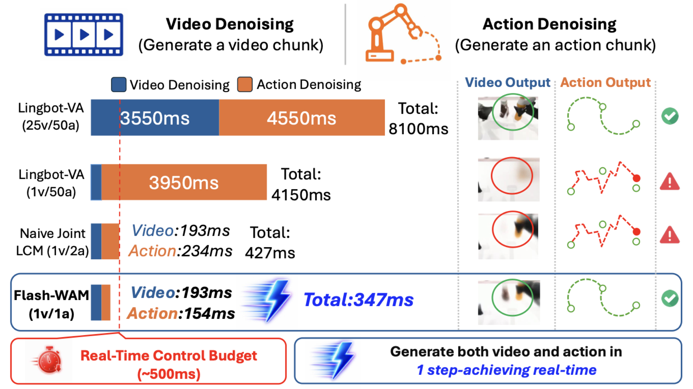

<h1 align="center">⚡ Flash-WAM: Modality-Aware Distillation for World Action Models</h1>

<p align="center">
  <a href="https://arxiv.org/abs/2606.05254"></a>
  <a href="https://flashwam.github.io"></a>
  <a href="LICENSE.txt"></a>
</p>

<p align="center">
  
</p>

Flash-WAM is a modality-aware step-distillation framework for joint video–action world models. It distills each modality with a consistency function matched to its noise regime — a linear-gradient-scaling choice for the low-noise action stream and a variance-preserving choice for the high-noise video stream — compressing LingBot-VA inference to a single step per modality. On RoboTwin 2.0 this yields up to a **23× speedup** (8.1 s → 348 ms per chunk) while preserving teacher-level task success.

This repository provides the Flash-WAM distillation code (the modality-aware method plus its LCM ablations), the FlowMap distillation code, the model code, and the distilled checkpoints.

## 📰 News

- **[2026-06]** Added FlowMap distillation with teacher Euler step + target student for improved action quality
- **[2026-06]** Added training optimizations (merged central difference, DataLoader optimization, EMA fused kernel)
- **[2026-06]** Flash-WAM RoboTwin checkpoint released on [🤗 HuggingFace](https://huggingface.co/NU-World-Model-Embodied-AI/FlashWAM-RoboTwin).
- **[2026-06]** Flash-WAM paper released on [arXiv](https://arxiv.org/abs/2606.05254).

## ✅ Checklist

- [x] Flash-WAM RoboTwin checkpoint
- [x] Distillation code (Flash-WAM + LCM ablations)
- [x] FlowMap distillation (teacher Euler step + target student)
- [x] Training optimizations (merged central difference, DataLoader, EMA)
- [x] LIBERO benchmark evaluation
- [ ] Real-world deployment setup on Unitree G1 humanoid

## 📦 Model Checkpoints

| Model | Repository | Description |
| :--- | :--- | :--- |
| LingBot-VA teacher (posttrain-robotwin) | [🤗 robbyant/lingbot-va-posttrain-robotwin](https://huggingface.co/robbyant/lingbot-va-posttrain-robotwin) | Teacher checkpoint to distill from |
| Flash-WAM distilled (RoboTwin) | [🤗 NU-World-Model-Embodied-AI/FlashWAM-RoboTwin](https://huggingface.co/NU-World-Model-Embodied-AI/FlashWAM-RoboTwin) | Single-step distilled student (complete, with encoders) |

Post-training dataset: [🤗 robbyant/robotwin-clean-and-aug-lerobot](https://huggingface.co/datasets/robbyant/robotwin-clean-and-aug-lerobot).

## 🚀 Quick Start

Flash-WAM builds on **LingBot-VA**. For **environment installation** and **evaluation**, follow the [LingBot-VA repository](https://github.com/Robbyant/lingbot-va) — Flash-WAM uses the same environment and the same RoboTwin server/client evaluation pipeline. Once the LingBot-VA environment is set up, this repository runs in it directly.

## 🔬 Distillation

### Original Flash-WAM (LCM)

Point the distiller at the teacher checkpoint and dataset, then select the method via `DISTILL_MODE`:

```bash
export TEACHER_PATH=/path/to/lingbot-va-posttrain-robotwin
export DATASET_PATH=/path/to/robotwin-clean-and-aug-lerobot

# Flash-WAM (the paper's modality-aware joint method)
DISTILL_MODE=flashwam bash distillation/run.sh

# LCM ablations from the paper
DISTILL_MODE=joint              bash distillation/run.sh   # naive joint LCM
DISTILL_MODE=video              bash distillation/run.sh   # video-only LCM
DISTILL_MODE=video_action_aware bash distillation/run.sh   # video-only LCM + reg
```

Key knobs (see `distillation/config.py`): `NGPU`, `OUTPUT_DIR`, `num_ddim_timesteps` (student video steps), `num_ddim_timesteps_action` (student action steps), `cfg_min`/`cfg_max` (teacher CFG range).

### FlowMap Distillation

FlowMap distillation uses teacher Euler step + target student for improved action quality:

```bash
# LIBERO environment
OPTIMIZED=1 NGPU=4 ORIG_ACCUM=32 bash distillation_flowmap/run_libero.sh

# Custom configuration
export TEACHER_PATH=/path/to/teacher
export DATASET_PATH=/path/to/dataset
export OUTPUT_DIR=/path/to/output
DISTILL_MODE=flashwam bash distillation_flowmap/run.sh
```

Key features of FlowMap distillation:
- **Teacher Euler step**: Teacher model generates pseudo ground truth via Euler step
- **Target student (EMA)**: EMA model generates distillation target at reference timestep
- **Merged central difference**: 4B batch for efficient flow map gradient computation
- **Selective central difference**: Only compute for non-diffusion samples (25% of batch)
- **DataLoader optimization**: 8 workers, pin_memory, prefetch_factor=4
- **EMA fused kernel**: `torch._foreach_lerp_` for faster EMA updates

Configuration files:
- `distillation_flowmap/config.py`: Default configuration
- `distillation_flowmap/config_libero.py`: LIBERO environment configuration
- `distillation_flowmap/config_libero_optimized.py`: Optimized LIBERO configuration

## 📊 Benchmarks

### LIBERO

Evaluation code for LIBERO benchmark is available in `evaluation/libero/`:

```bash
# Launch evaluation server
bash evaluation/libero/launch_server.sh

# Run evaluation client
bash evaluation/libero/run_eval.sh
```

### RoboTwin

Evaluation code for RoboTwin benchmark is available in `evaluation/robotwin/`:

```bash
# Launch evaluation server
bash evaluation/robotwin/launch_server.sh

# Run evaluation client
bash evaluation/robotwin/launch_client.sh
```

## 🏗️ Architecture

```
Flash-WAM/
├── distillation/              # Original LCM distillation
│   ├── config.py              # Configuration
│   ├── step.py                # Training step (LCM)
│   ├── trainer.py             # Trainer
│   └── run.sh                 # Launch script
├── distillation_flowmap/      # FlowMap distillation
│   ├── config.py              # Default configuration
│   ├── config_libero.py       # LIBERO configuration
│   ├── flowmap_step.py        # Training step (FlowMap)
│   ├── flowmap_trainer.py     # Trainer
│   ├── model_flowmap.py       # FlowMap model modifications
│   └── run_libero.sh          # LIBERO launch script
├── wan_va/                    # Model architecture
│   ├── modules/
│   │   └── model.py           # WanTransformer3DModel
│   ├── dataset/
│   │   └── lerobot_latent_dataset.py  # Dataset
│   └── distributed/
│       ├── fsdp.py            # FSDP utilities
│       └── util.py            # Distributed utilities
└── evaluation/                # Evaluation benchmarks
    ├── libero/                # LIBERO benchmark
    └── robotwin/              # RoboTwin benchmark
```

## ⚡ Performance Optimizations

### Training Speed

| Optimization | Description | Expected Speedup |
|:---|:---|:---|
| Merged central difference | 4B batch for t+ε and t-ε | 20-30% |
| Selective central difference | Only for non-diffusion samples | 20-30% |
| DataLoader optimization | 8 workers, pin_memory | 2-5x |
| EMA fused kernel | `torch._foreach_lerp_` | 5-10% |
| Eliminate redundant noise | `_prepare_base_dict` | 10-20% |

### Memory Optimization

| Optimization | Description | Expected Savings |
|:---|:---|:---|
| LoRA fine-tuning | rank=128, alpha=64 | ~90% trainable params |
| Activation checkpointing | Per transformer block | ~50% activation memory |
| BF16 mixed precision | Teacher + student | ~50% model memory |

## 📝 Citation

```bibtex
@misc{akbari2026flashwammodalityawaredistillationworld,
      title={Flash-WAM: Modality-Aware Distillation for World Action Models}, 
      author={Arman Akbari and Ci Zhang and Arash Akbari and Lin Zhao and Yixiao Chen and Weiwei Chen and Xuan Zhang and Geng Yuan and Yanzhi Wang},
      year={2026},
      eprint={2606.05254},
      archivePrefix={arXiv},
      primaryClass={cs.LG},
      url={https://arxiv.org/abs/2606.05254}, 
}
```

## 🙏 Acknowledgements

Built on [LingBot-VA](https://github.com/Robbyant/lingbot-va) and evaluated on [RoboTwin 2.0](https://github.com/RoboTwin-Platform/RoboTwin) and [LIBERO](https://github.com/Lifelong-Robot-Learning/LIBERO). Licensed under Apache-2.0.
